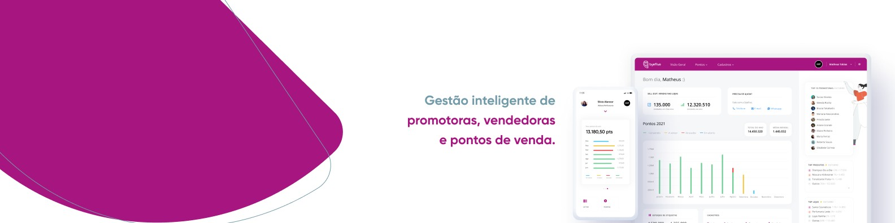

#  Byefive

   

 

<!-- 

   
   

 -->

---

## :pushpin: Table of Contents

-   [Como Executar](#rocket-como-executar)

## :rocket: Como Executar

Primeiro você deve ter o [Node.js](https://nodejs.org/en/download/) e, consequentemente o [npm](https://www.npmjs.com/get-npm). Para clonar este repositório via HTTPS, utilize o seguinte comando:
`git clone https://github.com/gabrielvrl/Byefive.git`
URLs SSH fornecem acesso a um repositório Git via SSH, um protocolo seguro. Se você tiver uma chave SSH registrada em sua conta do Github, clone o projeto usando este comando:
`git clone git@github.com:gabrielvrl/Byefive.git`

Entre na pasta do frontend e instale as dependências
`cd frontend`
`npm install`

Entre na pasta do backend e instale as dependências
`cd backend`
`npm install`

Dentro da pasta do backend execute
`npm run dev`

Agora, dentro da pasta frontend execute
`npm start`
